| title | DMX-Unit-DIY |
| --- | --- |
| author | GLOXIOU |
| description | A DIY project for a DMX controller box that enables stable lighting control via Wi-Fi or USB, featuring both Art-Net and DMX outputs. |
| created_at | 2026-09-08 |

# Day 1: Defining system & idea search & inspiration

I want to make a DMX Box, with WiFi and USB input, and DMX and ArtNet output. All of that in a small box, designed in 3D in Fusion 360. Everything will be managed by an ESP32, and cooled by a 40x40 tiny little fan.

My inspiration is the Enttec Open DMX USB Interface. I want to make that, but for much cheaper, and with more functionality. The only thing I want to keep from that housing is his formfactor, a very small box.

So, here is an initial list of the equipment needed for the project which, of course, is still subject to change:

| Component | Quantity | Price |
| --- | --- | --- |
| [W5500](https://fr.aliexpress.com/item/1005007639330460.html?spm=a2g0o.productlist.main.25.1d60HEhYHEhYee&algo_pvid=0f0acce3-f6cd-4a22-b593-d51b8eada731&algo_exp_id=0f0acce3-f6cd-4a22-b593-d51b8eada731-24&pdp_ext_f=%7B%22order%22%3A%22108%22%2C%22spu_best_type%22%3A%22price%22%2C%22eval%22%3A%221%22%2C%22fromPage%22%3A%22search%22%7D&pdp_npi=6%40dis%21EUR%215.30%215.29%21%21%2140.40%2140.29%21%4021038b2f17889557131767616e0d3a%2112000041604123554%21sea%21FR%218054027548%21X%211%210%21n_tag%3A-29919%3Bd%3A8484f755%3Bm03_new_user%3A-29895&curPageLogUid=lCvwNo44uc1k&utparam-url=scene%3Asearch%7Cquery_from%3A%7Cx_object_id%3A1005007639330460%7C_p_origin_prod%3A) | 1 | 6,27$ |
| [MAX485 RS-485 Module](https://fr.aliexpress.com/item/1005007894242423.html?spm=a2g0o.productlist.main.3.5fd3zSbszSbsXr&algo_pvid=d56afe0b-21f8-4b11-8f99-638839c320af&algo_exp_id=d56afe0b-21f8-4b11-8f99-638839c320af-2&pdp_ext_f=%7B%22order%22%3A%22351%22%2C%22eval%22%3A%221%22%2C%22fromPage%22%3A%22search%22%7D&pdp_npi=6%40dis%21EUR%211.25%211.25%21%21%219.55%219.54%21%400b0fe32e17889555838955185e1037%2112000042746081762%21sea%21FR%218054027548%21X%211%210%21n_tag%3A-29919%3Bd%3A8484f755%3Bm03_new_user%3A-29895&curPageLogUid=UBZ42MqFrULk&utparam-url=scene%3Asearch%7Cquery_from%3A%7Cx_object_id%3A1005007894242423%7C_p_origin_prod%3A) | 2 | 3,26$ |
| [ESP32-S3](https://fr.aliexpress.com/item/1005008809316571.html?spm=a2g0o.productlist.main.2.6d55eLipeLipSU&algo_pvid=bfca7475-6b4e-44c6-98ae-8b215c747978&algo_exp_id=bfca7475-6b4e-44c6-98ae-8b215c747978-1&pdp_ext_f=%7B%22order%22%3A%22167%22%2C%22spu_best_type%22%3A%22price%22%2C%22eval%22%3A%221%22%2C%22fromPage%22%3A%22search%22%7D&pdp_npi=6%40dis%21EUR%213.39%213.39%21%21%2125.82%2125.82%21%400b88a95617889558126386531e1096%2112000046760012014%21sea%21FR%218054027548%21X%211%210%21n_tag%3A-29919%3Bd%3A8484f755%3Bm03_new_user%3A-29895&curPageLogUid=g8268Xl08Vs9&utparam-url=scene%3Asearch%7Cquery_from%3A%7Cx_object_id%3A1005008809316571%7C_p_origin_prod%3A) | 1 | 3,95$ |
| [XLR 3-Pin Panel Mount Female](https://fr.aliexpress.com/item/1005008919369057.html?spm=a2g0o.productlist.main.2.4a51MVeMMVeMWA&algo_pvid=e0ece075-0aaa-4f06-ab41-6a22985836ec&algo_exp_id=e0ece075-0aaa-4f06-ab41-6a22985836ec-1&pdp_ext_f=%7B%22order%22%3A%22264%22%2C%22spu_best_type%22%3A%22price%22%2C%22eval%22%3A%221%22%2C%22fromPage%22%3A%22search%22%7D&pdp_npi=6%40dis%21EUR%214.78%214.19%21%21%2136.38%2131.92%21%400b884c0217889558724618995e0ddf%2112000047204519430%21sea%21FR%218054027548%21X%211%210%21n_tag%3A-29919%3Bd%3A8484f755%3Bm03_new_user%3A-29895%3BpisId%3A5000000216883978&curPageLogUid=MrT1mPRK6SSd&utparam-url=scene%3Asearch%7Cquery_from%3A%7Cx_object_id%3A1005008919369057%7C_p_origin_prod%3A) | 2 | 4,88$ |
| [12-Hole Bridge](https://fr.aliexpress.com/item/1005006003920533.html?spm=a2g0o.productlist.main.20.33efk9oLk9oL8b&algo_pvid=b609f09d-7277-4df6-8350-8b8b5d94a1f4&algo_exp_id=b609f09d-7277-4df6-8350-8b8b5d94a1f4-19&pdp_ext_f=%7B%22order%22%3A%221676%22%2C%22eval%22%3A%221%22%2C%22fromPage%22%3A%22search%22%7D&pdp_npi=6%40dis%21EUR%210.20%210.20%21%21%211.52%211.53%21%402161390417889560193225853e0d05%2112000038436951485%21sea%21FR%218054027548%21X%211%210%21n_tag%3A-29919%3Bd%3A8484f755%3Bm03_new_user%3A-29895&curPageLogUid=lWu04i0ta9rA&utparam-url=scene%3Asearch%7Cquery_from%3A%7Cx_object_id%3A1005006003920533%7C_p_origin_prod%3A) | 2 | 0,81$x2 |
| [Dupont cables](https://www.aliexpress.com/ssr/300000512/BundleDealsDutyCovered?spm=a2g0o.productlist.main.2.1b906O2g6O2gym&businessCode=guide&productIds=1005010507692120%3A12000052633643465&pha_manifest=ssr&_immersiveMode=true&disableNav=YES&sourceName=SEARCHProduct&utparam-url=scene%3Asearch%7Cquery_from%3A%7Cx_object_id%3A1005010507692120%7C_p_origin_prod%3A&pvid=e4ad24b8-270b-40f2-91a1-67cd1aca7107&_gl=1*xgdl6l*_gcl_aw*R0NMLjE3ODg5NTQ5MzUuQ2owS0NRandoNFRWQmhDV0FSSXNBRzBjem1xZUJOUGg5TUdlYW9UeE05dVVhaGhQSnNYbGd1MXYxUGpBMU1kc0VxSFhndmdkRVFQQWpOVWFBbmd3RUFMd193Y0I.*_gcl_au*ODI2MjUwMjg4LjE3ODg4OTc4Mzc.*_ga*MzczMTU2MzkuMTc4ODg5NzgzNw..*_ga_VED1YSGNC7*czE3ODg5NTQ5MzQkbzIkZzEkdDE3ODg5NTYyNDMkajEzJGwwJGgw) | kit | 2,48$ |
| **Total** | | **22,46$** |

I then drew the wiring diagram showing the connections between the components. Here is what I’ve managed to put together, but just like the list of components it’s still subject to change. Here is it:

And the summary table:

**ESP32-S3 (S3-N16R8)**

| ESP32-S3 Pin | Connected Component | Component Pin |
| :--- | :--- | :--- |
| **3V3** | W5500 Mini | 3.3V (J1, Pin 1) |
| **GND** | W5500 Mini / MAX485 #1 / MAX485 #2 / XLR #1 / XLR #2 | GND / Pin 1 (XLR) |
| **5Vin** | MAX485 #1 / MAX485 #2 | VCC |
| **GPIO 4** | MAX485 #1 | DE + RE (tied together) |
| **GPIO 5** | MAX485 #2 | DE + RE (tied together) |
| **GPIO 9** | W5500 Mini | RST (J2, Pin 2) |
| **GPIO 10** | W5500 Mini | SCS / CS (J2, Pin 1) |
| **GPIO 11** | W5500 Mini | MOSI (J1, Pin 4) |
| **GPIO 12** | W5500 Mini | SCLK (J1, Pin 5) |
| **GPIO 13** | W5500 Mini | MISO (J1, Pin 3) |
| **GPIO 17** | MAX485 #1 | DI |
| **GPIO 18** | MAX485 #2 | DI |

**W5500 Mini (Top view, RJ45 facing down)**

| Row | Pin | Signal | ESP32-S3 Connection |
| :--- | :--- | :--- | :--- |
| **Left (J1)** | 1 (Top) | **3.3V** | **3V3** |
| **Left (J1)** | 2 | **GND** | **GND** |
| **Left (J1)** | 3 | **MISO** | **GPIO 13** |
| **Left (J1)** | 4 | **MOSI** | **GPIO 11** |
| **Left (J1)** | 5 (Bottom) | **SCLK** | **GPIO 12** |
| **Right (J2)** | 1 (Top) | **SCS** | **GPIO 10** |
| **Right (J2)** | 2 | **RST** | **GPIO 9** |
| **Right (J2)** | 3 | **INT** | *Not connected* |
| **Right (J2)** | 4 | **NC** | *Not connected* |
| **Right (J2)** | 5 (Bottom) | **NC** | *Not connected* |

**MAX485 Module #1 (DMX Universe 1)**

| MAX485 #1 Pin | Connection |
| :--- | :--- |
| **VCC** | **5Vin** (ESP32-S3) |
| **GND** | **GND** (ESP32-S3) + Pin 1 (XLR #1) |
| **DI** | **GPIO 17** (ESP32-S3) |
| **RO** | *Not connected* |
| **DE** | **GPIO 4** (ESP32-S3) |
| **RE** | **GPIO 4** (ESP32-S3, tied with DE) |
| **A** | Pin 3 / DMX+ (XLR #1) |
| **B** | Pin 2 / DMX- (XLR #1) |

**MAX485 Module #2 (DMX Universe 2)**

| MAX485 #2 Pin | Connection |
| :--- | :--- |
| **VCC** | **5Vin** (ESP32-S3) |
| **GND** | **GND** (ESP32-S3) + Pin 1 (XLR #2) |
| **DI** | **GPIO 18** (ESP32-S3) |
| **RO** | *Not connected* |
| **DE** | **GPIO 5** (ESP32-S3) |
| **RE** | **GPIO 5** (ESP32-S3, tied with DE) |
| **A** | Pin 3 / DMX+ (XLR #2) |
| **B** | Pin 2 / DMX- (XLR #2) |

**3-Pin XLR Connectors**

| XLR Connector | XLR Pin | Connection |
| :--- | :--- | :--- |
| **XLR #1 (Universe 1)** | Pin 1 (Shield) | **GND** |
| **XLR #1 (Universe 1)** | Pin 2 (Data -) | **B** (MAX485 #1) |
| **XLR #1 (Universe 1)** | Pin 3 (Data +) | **A** (MAX485 #1) |
| **XLR #2 (Universe 2)** | Pin 1 (Shield) | **GND** |
| **XLR #2 (Universe 2)** | Pin 2 (Data -) | **B** (MAX485 #2) |
| **XLR #2 (Universe 2)** | Pin 3 (Data +) | **A** (MAX485 #2) |

**Total time spent: 3 hours**

# Day 2: 3D conception and other stuff

I want to make a small box, the smalest possible with all of the componment. That box will be print in PLA, on a Bambulab A1. So the maximum size is 25,6cm by 25,6cm. This enclosure must therefore house a small 40x40mm fan, two XLR ports and the necessary circuitry to operate them, an Art-Net port and the necessary circuitry to operate it, as well as a USB-C port—already integrated into the ESP32, which must also be inside the enclosure.

I'm now making the box on Fusion 360, with the dimension of the componment. Here's what it's look like: (You can check the V1 file [just here](3D-files/DMX%20Unit%20-%20V1.stl).)

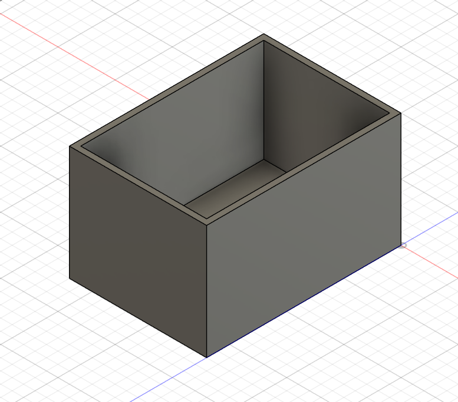

An XLR connector is 1.6 cm wide. We have 2, and between those two centres, there is a 6 cm gap . On top of that, there is a 3 cm gap  between the outer edges (right and left) and the centres of the XLR connectors. Adding all that up, you end up with a box that is 12 cm wide . It fits on the Bambu Lab A1 build plate.

As for the length, the ESP-32 is 5,5cm long, and the MAX485 is 4,5. The Ethernet module is litlle, and don't need to be add to the calculation. But, there's the the length of the XLR connectors, and the addition of extra space to make assembly easier. So the box will be 17cm.

Regarding the height of the box, the main consideration is ease of construction. The box will therefore be 10 cm high.

So, to sum up, the box measures 12x17x10. It fits perfectly on the Bambu Lab A1 build plate! I think I'm going to spend a lot of time on 3D, simply because I'm just starting out with modeling.

Regarding airflow, I decided to mount the 40x40mm fan inside the enclosure—on the lid, directly above the ESP-32—to improve cooling and save space. Near the bottom, along the two 17cm-long sides, there will be a grille of some sort to allow air to exit the box. Even though hot air rises, my experience has taught me that it is better to direct the airflow straight onto the ESP to cool it down.

To close the box, I am going to install heat-set threaded inserts that will allow the lid to be screwed on.

Here is a list of items to buy for the box, other than the electronic components:

| Components | Quantity | Price |
| --- | --- | --- |
| [heat-set threaded inserts](https://fr.aliexpress.com/item/1005007640664497.html?spm=a2g0o.productlist.main.1.778csXo5sXo5aw&algo_pvid=30feabc0-38ea-4b05-86c4-2357c562b8c2&algo_exp_id=30feabc0-38ea-4b05-86c4-2357c562b8c2-0&pdp_ext_f=%7B%22order%22%3A%225083%22%2C%22spu_best_type%22%3A%22price%22%2C%22eval%22%3A%221%22%2C%22fromPage%22%3A%22search%22%7D&pdp_npi=6%40dis%21EUR%211.60%211.59%21%21%2112.16%2112.16%21%4021613ab217889777444728314e0e3d%2112000041610082721%21sea%21FR%218054027548%21X%211%210%21n_tag%3A-29919%3Bd%3A8484f755%3Bm03_new_user%3A-29895&curPageLogUid=nZzh1hYDuUu2&utparam-url=scene%3Asearch%7Cquery_from%3A%7Cx_object_id%3A1005007640664497%7C_p_origin_prod%3A) | 4 | 1,86$ |
| [M2 metric screws](https://fr.aliexpress.com/item/32810852732.html?spm=a2g0o.productlist.main.25.7b72WZI7WZI71b&algo_pvid=a52b5964-ae35-4c25-88f5-7672ea9b0567&algo_exp_id=a52b5964-ae35-4c25-88f5-7672ea9b0567-24&pdp_ext_f=%7B%22order%22%3A%2238681%22%2C%22spu_best_type%22%3A%22price%22%2C%22eval%22%3A%221%22%2C%22fromPage%22%3A%22search%22%7D&pdp_npi=6%40dis%21EUR%210.93%210.93%21%21%211.06%211.06%21%400b88a96117889781167748255e0d67%2112000037550700828%21sea%21FR%218054027548%21X%211%210%21n_tag%3A-29919%3Bd%3A8484f755%3Bm03_new_user%3A-29895&curPageLogUid=yqNchI8doQay&utparam-url=scene%3Asearch%7Cquery_from%3A%7Cx_object_id%3A32810852732%7C_p_origin_prod%3A) | 4 | 1,54$ |
| [40x40mm fan](https://fr.aliexpress.com/item/1005006212685458.html?spm=a2g0o.productlist.main.9.19c91dabZlCLcX&algo_pvid=c5dde0a6-1d89-4d21-a38d-668a8cb81afe&algo_exp_id=c5dde0a6-1d89-4d21-a38d-668a8cb81afe-8&pdp_ext_f=%7B%22order%22%3A%22249%22%2C%22spu_best_type%22%3A%22price%22%2C%22eval%22%3A%221%22%2C%22fromPage%22%3A%22search%22%7D&pdp_npi=6%40dis%21EUR%212.76%212.76%21%21%213.14%213.14%21%400b15831117889782436123742e0df0%2112000036302788983%21sea%21FR%218054027548%21X%211%210%21n_tag%3A-29919%3Bd%3A8484f755%3Bm03_new_user%3A-29895&curPageLogUid=smatY7d7R5pJ&utparam-url=scene%3Asearch%7Cquery_from%3A%7Cx_object_id%3A1005006212685458%7C_p_origin_prod%3A) | 1 | 3,21$ |
| [2N2222 Transistor](https://fr.aliexpress.com/item/1005010473134376.html?spm=a2g0o.productlist.main.14.6edffnUbfnUbFK&algo_pvid=9c89de3c-24df-4041-b67a-93f5c3d7e74d&algo_exp_id=9c89de3c-24df-4041-b67a-93f5c3d7e74d-13&pdp_ext_f=%7B%22order%22%3A%22124%22%2C%22eval%22%3A%221%22%2C%22fromPage%22%3A%22search%22%7D&pdp_npi=6%40dis%21EUR%211.26%211.27%21%21%211.43%211.44%21%40210389a017889784226188831e0e94%2112000059797611860%21sea%21FR%218054027548%21X%211%210%21n_tag%3A-29919%3Bd%3A8484f755%3Bm03_new_user%3A-29895&curPageLogUid=Km86xQt6iFVC&utparam-url=scene%3Asearch%7Cquery_from%3A%7Cx_object_id%3A1005010473134376%7C_p_origin_prod%3A) | 1 | 1,55$ |
| [1 kΩ resistor](https://fr.aliexpress.com/item/1005007010335100.html?spm=a2g0o.productlist.main.2.523edbe8tuC53K&algo_pvid=eab16429-cd6a-4887-bafe-4d5f768fbbed&algo_exp_id=eab16429-cd6a-4887-bafe-4d5f768fbbed-1&pdp_ext_f=%7B%22order%22%3A%227875%22%2C%22spu_best_type%22%3A%22price%22%2C%22eval%22%3A%221%22%2C%22fromPage%22%3A%22search%22%7D&pdp_npi=6%40dis%21EUR%211.13%211.13%21%21%218.58%218.58%21%40210384a717889787428548103e0d2e%2112000039049464817%21sea%21FR%218054027548%21X%211%210%21n_tag%3A-29919%3Bd%3A8484f755%3Bm03_new_user%3A-29895&curPageLogUid=Rd7q4RmfGcL3&utparam-url=scene%3Asearch%7Cquery_from%3A%7Cx_object_id%3A1005007010335100%7C_p_origin_prod%3A) | 1 | 1,59$ |

To run the fan, you need to add a 2N2222 transistor and a 1 kΩ resistor. So, I need to updated the ESP-32 wiring diagram with all that. I also need to changes the 3D model, with the cover and all the wholes.

**Total time spent: 3.5 hours**

# Day 3: Continue the 3D model and the ESP-32 wiring diagram

I started by updating the 3D model: (You can check the V2 file [just here](3D-files/DMX%20Unit%20-%20V2.stl).)

Here are the cotations for the output pannel, in the front of the box:

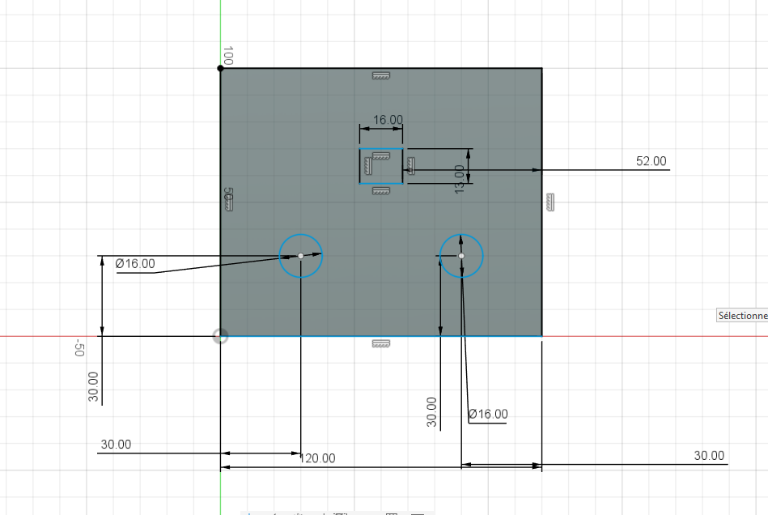

And it's 3D version (with a litlle text):

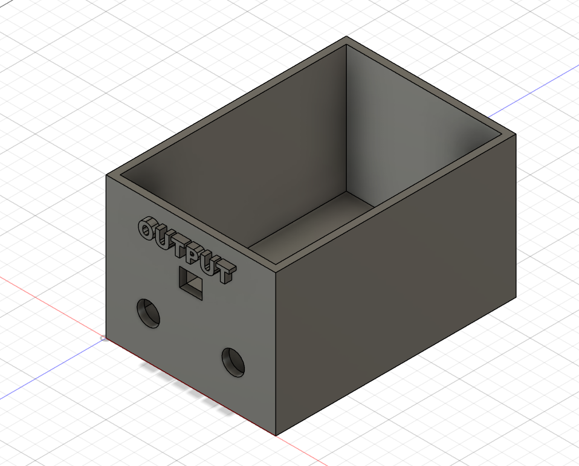

That is the back pannel, with just the hole for the ESP32-S3 (I made it generously sized for ease of use):

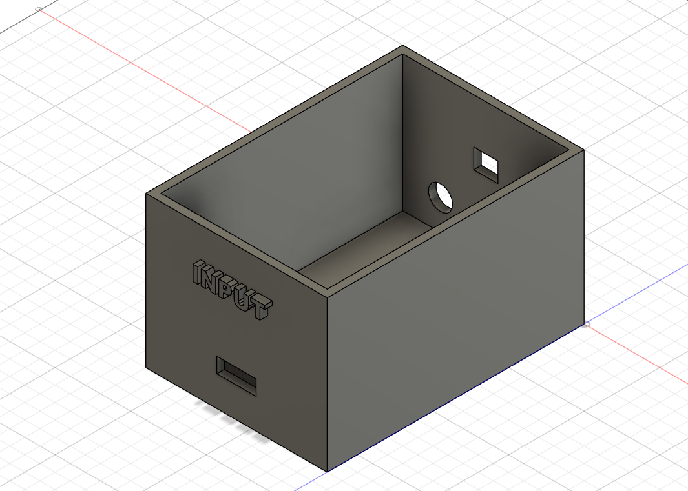

I’ve also made a lid. All that’s left is to make the mounts for the components and the lid itself. I also need to make the ventilation grilles on both sides, but that's very simple to do. I apologize for the quality of the 3D models, I hate modeling, so I kept it as simple as possible so I could spend time on what I enjoy more !

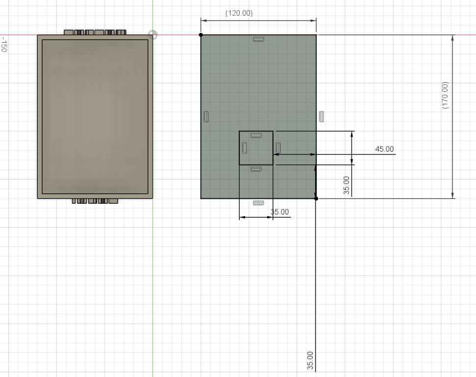

To secure the components, I would use cable ties with the mounts I've made, and for the fan, glue will do the trick.

And the I finished the wiring diagram, wich normally is the final version:

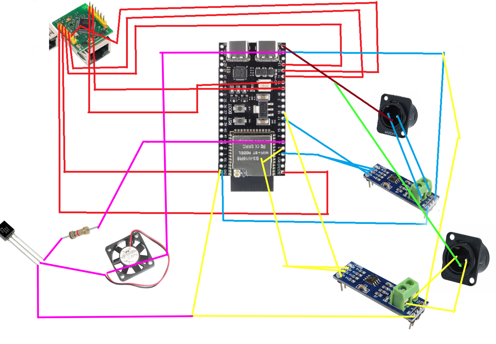

Please excuse the state of the wiring diagram. I had to create it on an iPad, which isn't very convenient. That’s why I’m making a connection chart to help me keep track of things when assembling the components. So I also updated the connection chart, so here is it:

ESP32-S3 (S3-N16R8)

ESP32-S3 Pin | Connected Component | Component Pin
--- | --- | ---
3V3 | W5500 Mini | 3.3V (J1, Pin 1)
GND | W5500 Mini / MAX485 #1 / MAX485 #2 / XLR #1 / XLR #2 / 2N2222 | GND / Pin 1 (XLR) / Emitter
5Vin | MAX485 #1 / MAX485 #2 / Fan | VCC / VCC / Fan +
GPIO 4 | MAX485 #1 | DE + RE (tied together)
GPIO 5 | MAX485 #2 | DE + RE (tied together)
GPIO 6 | Fan circuit | 1kΩ resistor → Base 2N2222
GPIO 9 | W5500 Mini | RST (J2, Pin 2)
GPIO 10 | W5500 Mini | SCS / CS (J2, Pin 1)
GPIO 11 | W5500 Mini | MOSI (J1, Pin 4)
GPIO 12 | W5500 Mini | SCLK (J1, Pin 5)
GPIO 13 | W5500 Mini | MISO (J1, Pin 3)
GPIO 17 | MAX485 #1 | DI
GPIO 18 | MAX485 #2 | DI

W5500 Mini (Top view, RJ45 facing down)

Row | Pin | Signal | ESP32-S3 Connection
--- | --- | --- | ---
Left (J1) | 1 (Top) | 3.3V | 3V3
Left (J1) | 2 | GND | GND
Left (J1) | 3 | MISO | GPIO 13
Left (J1) | 4 | MOSI | GPIO 11
Left (J1) | 5 (Bottom) | SCLK | GPIO 12
Right (J2) | 1 (Top) | SCS | GPIO 10
Right (J2) | 2 | RST | GPIO 9
Right (J2) | 3 | INT | Not connected
Right (J2) | 4 | NC | Not connected
Right (J2) | 5 (Bottom) | NC | Not connected

MAX485 Module #1 (DMX Universe 1)

MAX485 #1 Pin | Connection
--- | ---
VCC | 5Vin (ESP32-S3)
GND | GND (ESP32-S3) + Pin 1 (XLR #1)
DI | GPIO 17 (ESP32-S3)
RO | Not connected
DE | GPIO 4 (ESP32-S3)
RE | GPIO 4 (ESP32-S3, tied with DE)
A | Pin 3 / DMX+ (XLR #1)
B | Pin 2 / DMX- (XLR #1)

MAX485 Module #2 (DMX Universe 2)

MAX485 #2 Pin | Connection
--- | ---
VCC | 5Vin (ESP32-S3)
GND | GND (ESP32-S3) + Pin 1 (XLR #2)
DI | GPIO 18 (ESP32-S3)
RO | Not connected
DE | GPIO 5 (ESP32-S3)
RE | GPIO 5 (ESP32-S3, tied with DE)
A | Pin 3 / DMX+ (XLR #2)
B | Pin 2 / DMX- (XLR #2)

3-Pin XLR Connectors

XLR Connector | XLR Pin | Connection
--- | --- | ---
XLR #1 (Universe 1) | Pin 1 (Shield) | GND
XLR #1 (Universe 1) | Pin 2 (Data -) | B (MAX485 #1)
XLR #1 (Universe 1) | Pin 3 (Data +) | A (MAX485 #1)
XLR #2 (Universe 2) | Pin 1 (Shield) | GND
XLR #2 (Universe 2) | Pin 2 (Data -) | B (MAX485 #2)
XLR #2 (Universe 2) | Pin 3 (Data +) | A (MAX485 #2)

Fan 40x40mm

| Fan Pin | Connection | 
| --- | --- |
| + | 5Vin (ESP32-S3) |
| - | Collector (2N2222) |

2N2222

2N2222 Pin | Connection
--- | ---
Base | GPIO 6 through 1kΩ resistor
Collector | Fan -
Emitter | GND

The RJ45 connector is tricky because, since it's the mini version, the port labels aren't printed on the PCB. So, I asked an LLM about the pinout.

Now that I've done that, all that's left is to finish the 3D model, write the full code, and create the readme. I think the modeling will take the longest. I also need to put together the complete BOM, including all prices and links.

**Total time spent: 5 hours**

# Day 4: 3D modeling, again...

I started by making the edge of the box curved, beacause aparently it's a requirment in HackClub, so here it is:

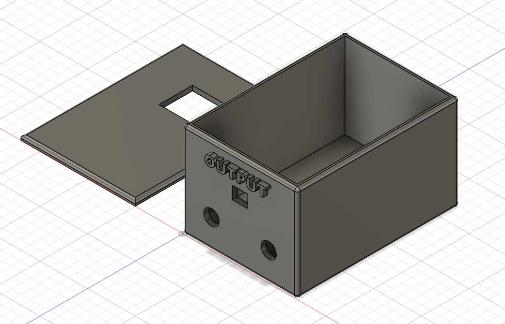

And, like other days, you can check the V3 file [just here](3D-files/DMX%20Unit%20-%20V3.stl).

Then I realized I'd made a mistake with the XLR output size. So I drilled another hole fot that, and for the screws.

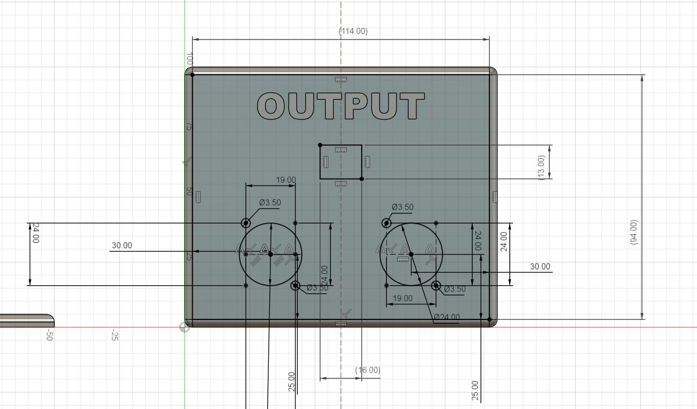
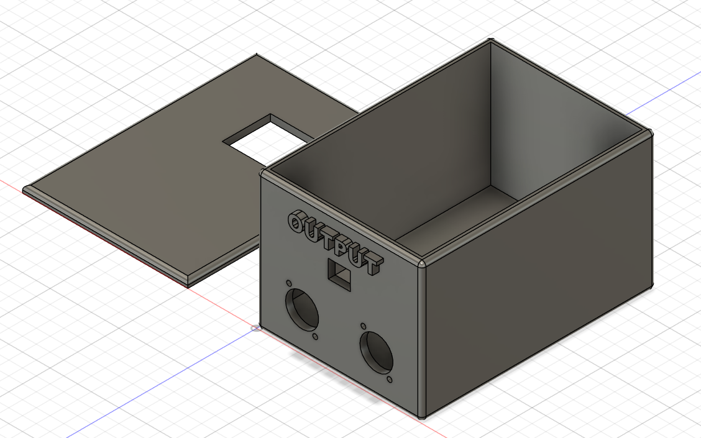

After that, I made the supports and the woles for the cover of the box. All that remains are the mounts for the components !

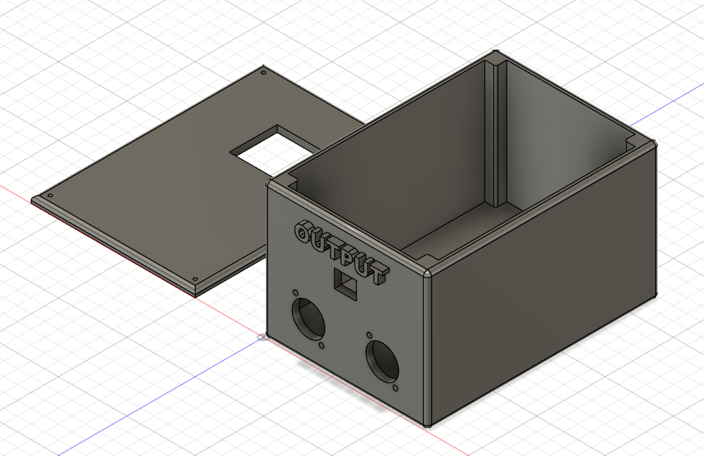

When I come back this afternoon, I search all the components on [grabcad](grabcad.com), download it, place it. You can check all the models I dowload in [this folder](3D-files/).

And I made the support for the components. I also delete the curve edge that I made on the top of the box, beacause thre is already one on the cover. The componment are also integreted, the assembly is also complete. So here's how the 3D model look so far:

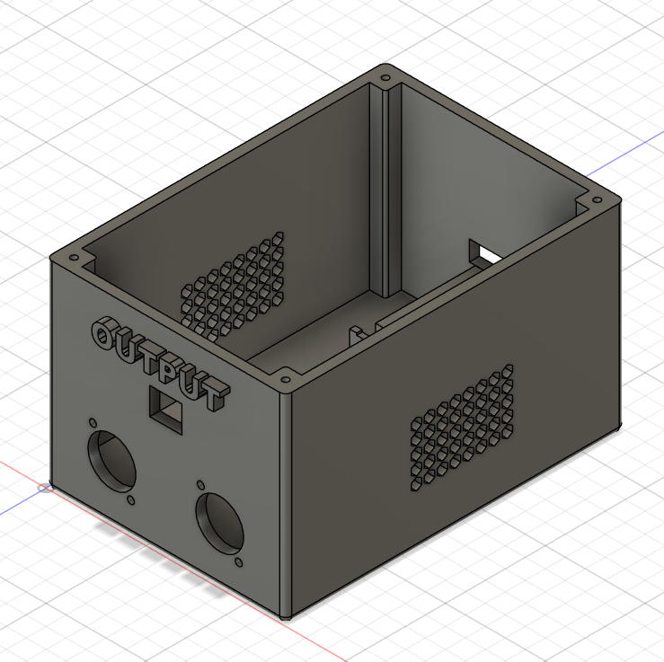

And there is the final 3D file [just here](3D-files/DMX%20Unit%20-%20V4%20-%20F.stl) !

Here are several screenshots of the model and the assembly:

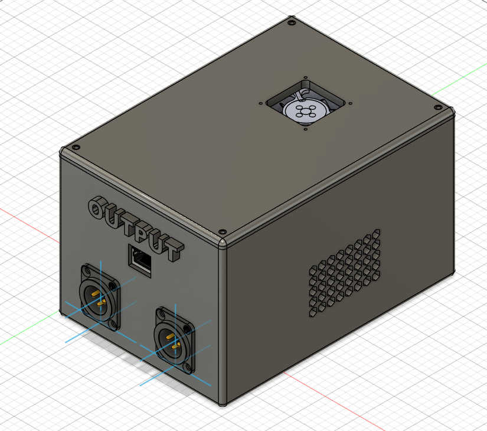
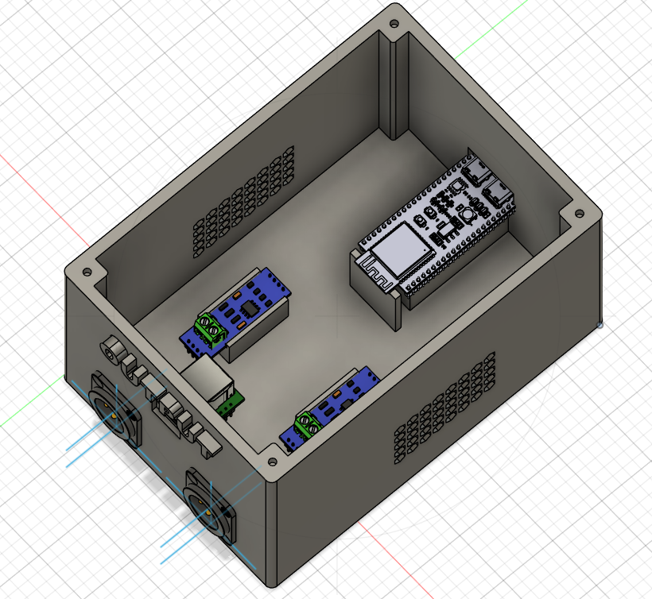
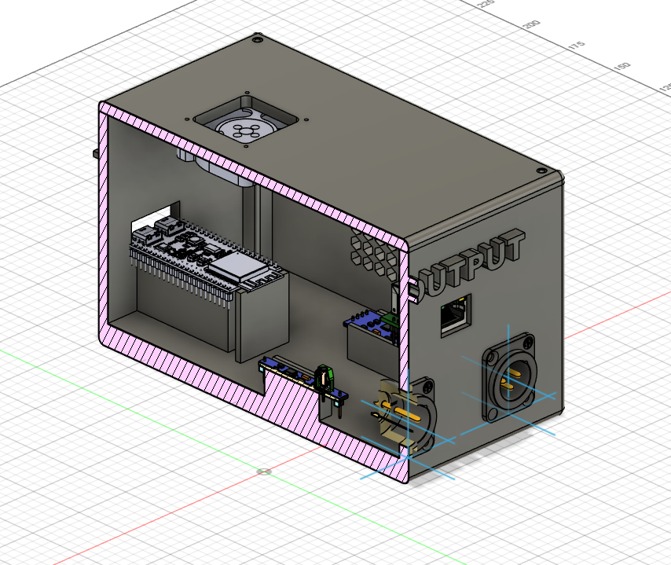

You can check all the final stl 3D files in [this folder](3D-files/to%20print/); the assembly files in [that folder](3D-files/assembly/) and the ultimate step assembly file [just here](3D-files/assembly/Unite%20DMX%20-%20Assembly.step)

Today was so much modeling, and I learn so much things ! To sum up, all the mounts are done including the one for the cover the components are in the right places, and the airflow is optimized. I think the case is really great !

**Total time spent: 5 hours**

# Day 5: BOM and begening of the code

I started the day by doing the BOM of the project using the tables I had already made on previous days: (You can check the CSV file [here](BOM.csv))

| Component | Quantity | Price |
| --- | ---: | ---: |
| [W5500](https://fr.aliexpress.com/item/1005007639330460.html) | 1 | $6.27 |
| [MAX485 RS-485 Module](https://fr.aliexpress.com/item/1005008477779481.html?spm=a2g0o.productlist.main.39.61a4672cybk6KC&algo_pvid=28383e4a-b567-4516-a6ae-09f1f8b8f8d6&algo_exp_id=28383e4a-b567-4516-a6ae-09f1f8b8f8d6-38&pdp_ext_f=%7B%22order%22%3A%2291%22%2C%22eval%22%3A%221%22%2C%22fromPage%22%3A%22search%22%7D&pdp_npi=6%40dis%21EUR%210.86%210.86%21%21%210.98%210.98%21%40210381f017891982833397272e0cf4%2112000045321729373%21sea%21FR%218054027548%21X%211%210%21n_tag%3A-29919%3Bd%3A8484f755%3Bm03_new_user%3A-29895&curPageLogUid=GAJrKxNpKqLO&utparam-url=scene%3Asearch%7Cquery_from%3A%7Cx_object_id%3A1005008477779481%7C_p_origin_prod%3A) | 2 | 2x$1 |
| [ESP32-S3](https://fr.aliexpress.com/item/1005008809316571.html) | 1 | $3.95 |
| [XLR 3-Pin Panel Mount Female](https://fr.aliexpress.com/item/1005008919369057.html) | 2 | $4.88 |
| [Dupont Cables](https://www.aliexpress.com/ssr/300000512/BundleDealsDutyCovered) | 1 kit | $2.48 |
| [Heat-Set Threaded Inserts](https://fr.aliexpress.com/item/1005007640664497.html) | 4 | $1.86 |
| [M2 Metric Screws](https://fr.aliexpress.com/item/32810852732.html) | 4 | $1.54 |
| [40 × 40 mm Fan](https://fr.aliexpress.com/item/1005006212685458.html) | 1 | $3.21 |
| [2N2222 Transistor](https://fr.aliexpress.com/item/1005010473134376.html) | 1 | $1.55 |
| [1 kΩ Resistor](https://fr.aliexpress.com/item/1005007010335100.html) | 1 | $1.59 |
| **Total** | | **$29,33** |

The chart didn't take me a huge amount of time, but I also verified the compatibility of all the components, the circuit diagram, as well as prices, links, quantities, and so on, just to be sure, since the project is nearing completion.

Next, I worked on the firmware. I would say about half the features are ready. It still needs testing, and most importantly, I need to go through this entire list:

* DMX/USB input ("Enttec-like" mode when connecting the ESP32-S3 via USB).
* Wi-Fi mode / configuration portal.
* **ArtPoll** response (the device will not automatically appear in
Art-Net discovery software — the IP address must be entered manually;
`192.168.1.77` by default in this sketch).
* Persistent settings storage (Preferences/EEPROM).
* RDM.

So there's still a little bit of work to do ! You can check the file V1 [just here](firvware%20-%20V1): Here is a look at the code:

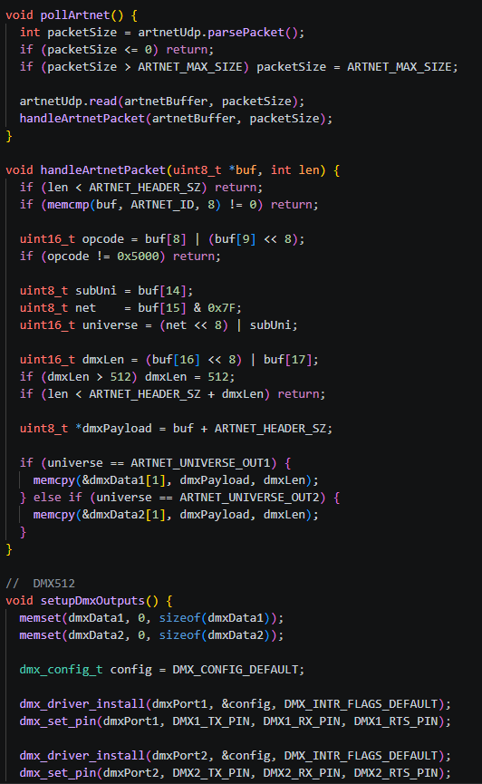

**Total time spent: 3 hours**