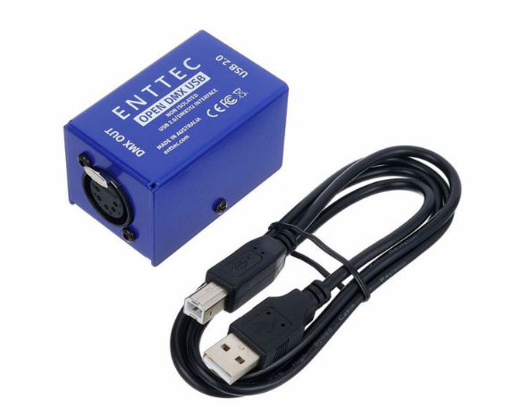
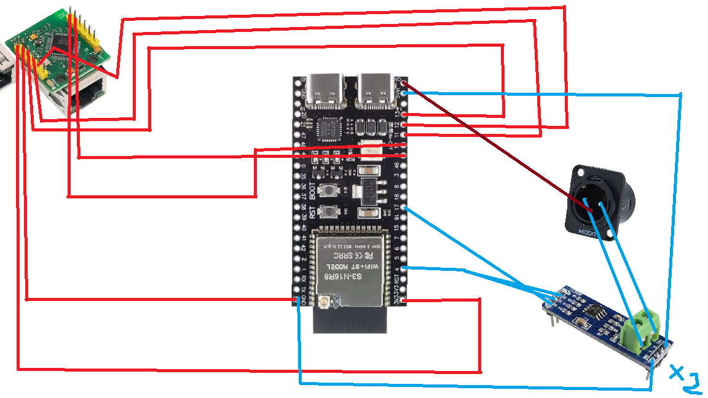

| title | DMX-Unit-DIY |
| --- | --- |
| author | GLOXIOU |
| description | A DIY project for a DMX controller box that enables stable lighting control via Wi-Fi or USB, featuring both Art-Net and DMX outputs. |
| created_at | 2026-09-08 |

# Day 1: Defining system & idea search & inspiration

I want to make a DMX Box, with WiFi and USB input, and DMX and ArtNet output. All of that in a small box, designed in 3D in Fusion 360. Everything will be managed by an ESP32, and cooled by a 40x40 tiny little fan.

My inspiration is the Enttec Open DMX USB Interface. I want to make that, but for much cheaper, and with more functionality. The only thing I want to keep from that housing is his formfactor, a very small box.

So, here is an initial list of the equipment needed for the project which, of course, is still subject to change:

| Component | Quantity | Price |
| --- | --- | --- |
| [W5500](https://fr.aliexpress.com/item/1005007639330460.html?spm=a2g0o.productlist.main.25.1d60HEhYHEhYee&algo_pvid=0f0acce3-f6cd-4a22-b593-d51b8eada731&algo_exp_id=0f0acce3-f6cd-4a22-b593-d51b8eada731-24&pdp_ext_f=%7B%22order%22%3A%22108%22%2C%22spu_best_type%22%3A%22price%22%2C%22eval%22%3A%221%22%2C%22fromPage%22%3A%22search%22%7D&pdp_npi=6%40dis%21EUR%215.30%215.29%21%21%2140.40%2140.29%21%4021038b2f17889557131767616e0d3a%2112000041604123554%21sea%21FR%218054027548%21X%211%210%21n_tag%3A-29919%3Bd%3A8484f755%3Bm03_new_user%3A-29895&curPageLogUid=lCvwNo44uc1k&utparam-url=scene%3Asearch%7Cquery_from%3A%7Cx_object_id%3A1005007639330460%7C_p_origin_prod%3A) | 1 | 6,27$ |
| [MAX485 RS-485 Module](https://fr.aliexpress.com/item/1005007894242423.html?spm=a2g0o.productlist.main.3.5fd3zSbszSbsXr&algo_pvid=d56afe0b-21f8-4b11-8f99-638839c320af&algo_exp_id=d56afe0b-21f8-4b11-8f99-638839c320af-2&pdp_ext_f=%7B%22order%22%3A%22351%22%2C%22eval%22%3A%221%22%2C%22fromPage%22%3A%22search%22%7D&pdp_npi=6%40dis%21EUR%211.25%211.25%21%21%219.55%219.54%21%400b0fe32e17889555838955185e1037%2112000042746081762%21sea%21FR%218054027548%21X%211%210%21n_tag%3A-29919%3Bd%3A8484f755%3Bm03_new_user%3A-29895&curPageLogUid=UBZ42MqFrULk&utparam-url=scene%3Asearch%7Cquery_from%3A%7Cx_object_id%3A1005007894242423%7C_p_origin_prod%3A) | 2 | 3,26$ |
| [ESP32-S3](https://fr.aliexpress.com/item/1005008809316571.html?spm=a2g0o.productlist.main.2.6d55eLipeLipSU&algo_pvid=bfca7475-6b4e-44c6-98ae-8b215c747978&algo_exp_id=bfca7475-6b4e-44c6-98ae-8b215c747978-1&pdp_ext_f=%7B%22order%22%3A%22167%22%2C%22spu_best_type%22%3A%22price%22%2C%22eval%22%3A%221%22%2C%22fromPage%22%3A%22search%22%7D&pdp_npi=6%40dis%21EUR%213.39%213.39%21%21%2125.82%2125.82%21%400b88a95617889558126386531e1096%2112000046760012014%21sea%21FR%218054027548%21X%211%210%21n_tag%3A-29919%3Bd%3A8484f755%3Bm03_new_user%3A-29895&curPageLogUid=g8268Xl08Vs9&utparam-url=scene%3Asearch%7Cquery_from%3A%7Cx_object_id%3A1005008809316571%7C_p_origin_prod%3A) | 1 | 3,95$ |
| [XLR 3-Pin Panel Mount Female](https://fr.aliexpress.com/item/1005008919369057.html?spm=a2g0o.productlist.main.2.4a51MVeMMVeMWA&algo_pvid=e0ece075-0aaa-4f06-ab41-6a22985836ec&algo_exp_id=e0ece075-0aaa-4f06-ab41-6a22985836ec-1&pdp_ext_f=%7B%22order%22%3A%22264%22%2C%22spu_best_type%22%3A%22price%22%2C%22eval%22%3A%221%22%2C%22fromPage%22%3A%22search%22%7D&pdp_npi=6%40dis%21EUR%214.78%214.19%21%21%2136.38%2131.92%21%400b884c0217889558724618995e0ddf%2112000047204519430%21sea%21FR%218054027548%21X%211%210%21n_tag%3A-29919%3Bd%3A8484f755%3Bm03_new_user%3A-29895%3BpisId%3A5000000216883978&curPageLogUid=MrT1mPRK6SSd&utparam-url=scene%3Asearch%7Cquery_from%3A%7Cx_object_id%3A1005008919369057%7C_p_origin_prod%3A) | 2 | 4,88$ |
| [12-Hole Bridge](https://fr.aliexpress.com/item/1005006003920533.html?spm=a2g0o.productlist.main.20.33efk9oLk9oL8b&algo_pvid=b609f09d-7277-4df6-8350-8b8b5d94a1f4&algo_exp_id=b609f09d-7277-4df6-8350-8b8b5d94a1f4-19&pdp_ext_f=%7B%22order%22%3A%221676%22%2C%22eval%22%3A%221%22%2C%22fromPage%22%3A%22search%22%7D&pdp_npi=6%40dis%21EUR%210.20%210.20%21%21%211.52%211.53%21%402161390417889560193225853e0d05%2112000038436951485%21sea%21FR%218054027548%21X%211%210%21n_tag%3A-29919%3Bd%3A8484f755%3Bm03_new_user%3A-29895&curPageLogUid=lWu04i0ta9rA&utparam-url=scene%3Asearch%7Cquery_from%3A%7Cx_object_id%3A1005006003920533%7C_p_origin_prod%3A) | 2 | 0,81$x2 |
| [Dupont cables](https://www.aliexpress.com/ssr/300000512/BundleDealsDutyCovered?spm=a2g0o.productlist.main.2.1b906O2g6O2gym&businessCode=guide&productIds=1005010507692120%3A12000052633643465&pha_manifest=ssr&_immersiveMode=true&disableNav=YES&sourceName=SEARCHProduct&utparam-url=scene%3Asearch%7Cquery_from%3A%7Cx_object_id%3A1005010507692120%7C_p_origin_prod%3A&pvid=e4ad24b8-270b-40f2-91a1-67cd1aca7107&_gl=1*xgdl6l*_gcl_aw*R0NMLjE3ODg5NTQ5MzUuQ2owS0NRandoNFRWQmhDV0FSSXNBRzBjem1xZUJOUGg5TUdlYW9UeE05dVVhaGhQSnNYbGd1MXYxUGpBMU1kc0VxSFhndmdkRVFQQWpOVWFBbmd3RUFMd193Y0I.*_gcl_au*ODI2MjUwMjg4LjE3ODg4OTc4Mzc.*_ga*MzczMTU2MzkuMTc4ODg5NzgzNw..*_ga_VED1YSGNC7*czE3ODg5NTQ5MzQkbzIkZzEkdDE3ODg5NTYyNDMkajEzJGwwJGgw) | kit | 2,48$ |
| **Total** | | **22,46$** |

I then drew the wiring diagram showing the connections between the components. Here is what I’ve managed to put together, but just like the list of components it’s still subject to change. Here is it:

And the summary table:

### ESP32-S3 (S3-N16R8)

| ESP32-S3 Pin | Connected Component | Component Pin |
| :--- | :--- | :--- |
| **3V3** | W5500 Mini | 3.3V (J1, Pin 1) |
| **GND** | W5500 Mini / MAX485 #1 / MAX485 #2 / XLR #1 / XLR #2 | GND / Pin 1 (XLR) |
| **5Vin** | MAX485 #1 / MAX485 #2 | VCC |
| **GPIO 4** | MAX485 #1 | DE + RE (tied together) |
| **GPIO 5** | MAX485 #2 | DE + RE (tied together) |
| **GPIO 9** | W5500 Mini | RST (J2, Pin 2) |
| **GPIO 10** | W5500 Mini | SCS / CS (J2, Pin 1) |
| **GPIO 11** | W5500 Mini | MOSI (J1, Pin 4) |
| **GPIO 12** | W5500 Mini | SCLK (J1, Pin 5) |
| **GPIO 13** | W5500 Mini | MISO (J1, Pin 3) |
| **GPIO 17** | MAX485 #1 | DI |
| **GPIO 18** | MAX485 #2 | DI |

---

### W5500 Mini (Top view, RJ45 facing down)

| Row | Pin | Signal | ESP32-S3 Connection |
| :--- | :--- | :--- | :--- |
| **Left (J1)** | 1 (Top) | **3.3V** | **3V3** |
| **Left (J1)** | 2 | **GND** | **GND** |
| **Left (J1)** | 3 | **MISO** | **GPIO 13** |
| **Left (J1)** | 4 | **MOSI** | **GPIO 11** |
| **Left (J1)** | 5 (Bottom) | **SCLK** | **GPIO 12** |
| **Right (J2)** | 1 (Top) | **SCS** | **GPIO 10** |
| **Right (J2)** | 2 | **RST** | **GPIO 9** |
| **Right (J2)** | 3 | **INT** | *Not connected* |
| **Right (J2)** | 4 | **NC** | *Not connected* |
| **Right (J2)** | 5 (Bottom) | **NC** | *Not connected* |

---

### MAX485 Module #1 (DMX Universe 1)

| MAX485 #1 Pin | Connection |
| :--- | :--- |
| **VCC** | **5Vin** (ESP32-S3) |
| **GND** | **GND** (ESP32-S3) + Pin 1 (XLR #1) |
| **DI** | **GPIO 17** (ESP32-S3) |
| **RO** | *Not connected* |
| **DE** | **GPIO 4** (ESP32-S3) |
| **RE** | **GPIO 4** (ESP32-S3, tied with DE) |
| **A** | Pin 3 / DMX+ (XLR #1) |
| **B** | Pin 2 / DMX- (XLR #1) |

---

### MAX485 Module #2 (DMX Universe 2)

| MAX485 #2 Pin | Connection |
| :--- | :--- |
| **VCC** | **5Vin** (ESP32-S3) |
| **GND** | **GND** (ESP32-S3) + Pin 1 (XLR #2) |
| **DI** | **GPIO 18** (ESP32-S3) |
| **RO** | *Not connected* |
| **DE** | **GPIO 5** (ESP32-S3) |
| **RE** | **GPIO 5** (ESP32-S3, tied with DE) |
| **A** | Pin 3 / DMX+ (XLR #2) |
| **B** | Pin 2 / DMX- (XLR #2) |

---

### 3-Pin XLR Connectors

| XLR Connector | XLR Pin | Connection |
| :--- | :--- | :--- |
| **XLR #1 (Universe 1)** | Pin 1 (Shield) | **GND** |
| **XLR #1 (Universe 1)** | Pin 2 (Data -) | **B** (MAX485 #1) |
| **XLR #1 (Universe 1)** | Pin 3 (Data +) | **A** (MAX485 #1) |
| **XLR #2 (Universe 2)** | Pin 1 (Shield) | **GND** |
| **XLR #2 (Universe 2)** | Pin 2 (Data -) | **B** (MAX485 #2) |
| **XLR #2 (Universe 2)** | Pin 3 (Data +) | **A** (MAX485 #2) |

**Time spent today:** ~2,5h